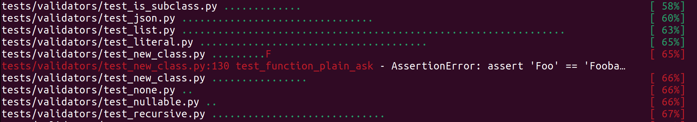
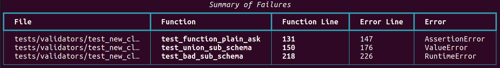

# pytest-pretty

[](https://github.com/samuelcolvin/pytest-pretty/actions?query=event%3Apush+branch%3Amain+workflow%3ACI)
[](https://pypi.python.org/pypi/pytest-pretty)
[](https://github.com/samuelcolvin/pytest-pretty)
[](https://github.com/samuelcolvin/pytest-pretty/blob/main/LICENSE)

Opinionated pytest plugin to make output slightly easier to read and errors easy to find and fix.

This plugin is inspired by [pytest-sugar](https://pypi.org/project/pytest-sugar/)

pytest-pretty's only dependencies are [rich](https://pypi.org/project/rich/) and pytest itself.

### Realtime error summary

One-line info on which test has failed while tests are running:



### Table of failures

A rich table of failures with both test line number and error line number:



This is extremely useful for navigating to failed tests without having to scroll through the entire test output.

### Prettier Summary of a Test Run

Including time taken for the test run:


## Installation

    pip install -U pytest-pretty

## Usage with GitHub Actions

If you're using pytest-pretty (or indeed, just pytest) with GitHub Actions, it's worth adding the following to the top of your workflow `.yml` file:

```yaml
env:
  COLUMNS: 120
```

This will mean the pytest output is wider and easier to use, more importantly, it'll make the error summary table printed by pytest-pretty much easier to read, see [this](https://github.com/Textualize/rich/issues/2769) discussion for more details.


## `pytester_pretty` fixture

The `pytest_pretty` provides `pytester_pretty` fixture that work with modified version of output. It is designed to drop in places replacement of `pytester` fixture and uses it internaly.

So to use them it is required to set `pytest_plugins = "pytester"` as mentioned in pytest documentation https://docs.pytest.org/en/latest/reference/reference.html#pytester
